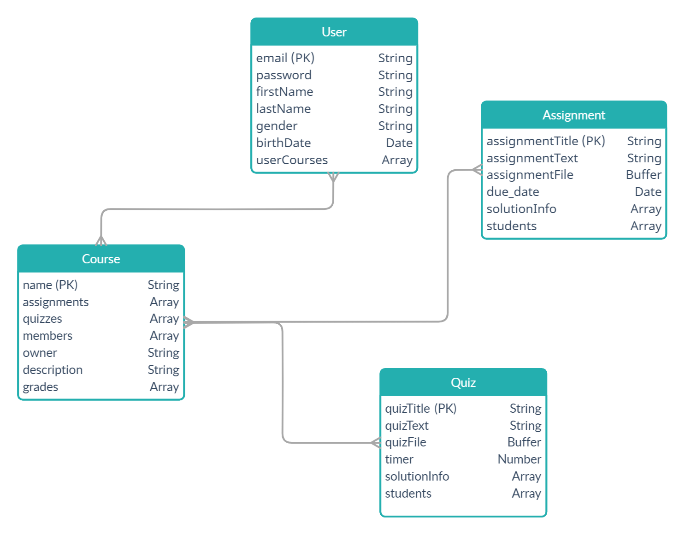
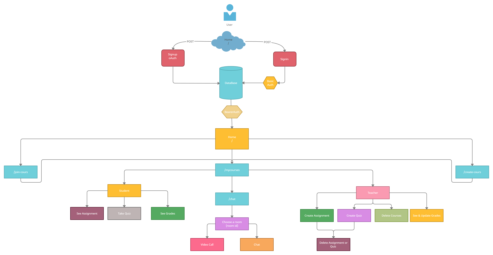

# Super Nova Group

-----------------------------

## My Online Uni

* Problem Domain:
    Due to COVID-19 situation we decided to create this web application to make the education process muck more easy.

* Group Members:
    1. Ishaq Al-Athamneh
    1. Reem Al-Qurm
    1. Naeem Musameh
    1. Malak Al-Momani
    1. Mus'ab Al-Omari

Database Diagram:

**Routes**:

> Authentication Routes:

| Method      | Endpoint | Description     |
| :---        |    :----:   |  :----:       |
| POST      | /signup       | Submit signup form   |
| GET      | /signin      | Show signin form   |
| POST      | /signin        | Submit signin form      |
| GET      | /auth/google       | Show oauth google form   |
| GET      | /auth/google/callback     | determine if outh success or failed   |
| GET      | /auth/google/failure      | return failed login   |
| GET      | /auth/google/success      | authorize the user to log in using google   |

> Courses Routes:

| Method      | Endpoint | Description     |
| :---        |    :----:   |  :----:       |
| POST      | /create-course       | create new course  |
| GET      | /my-courses       | return all user's courses   |
| POST      | /join-course       | allow user to join course using key   |
| POST      | /course/:courseID/create-assignment       | only the owner can create assignment inside the course   |
| POST      | /course/:courseID/create-quiz       | only the owner can create quiz inside the course   |
| get      | /course/:courseID/grades       | to show the grades   |
| POST      | /course/:courseID/grades       | only the owner can edit the grades   |
| POST      | /course/:courseID/:assignmentID/submit-assignment       | allow the members to sumbit the assignments   |
| POST      | /course/:courseID/:quizID/submit-quiz      | allow the members to sumbit the quizzes   |

> to-do Routes:

| Method      | Endpoint | Description     |
| :---        |    :----:   |  :----:       |
| GET      | /task       | show incoming tasks for the member   |

* Trelllo Board :
[Click Here](https://trello.com/b/gDHcanLR)

* UML Diagram :

